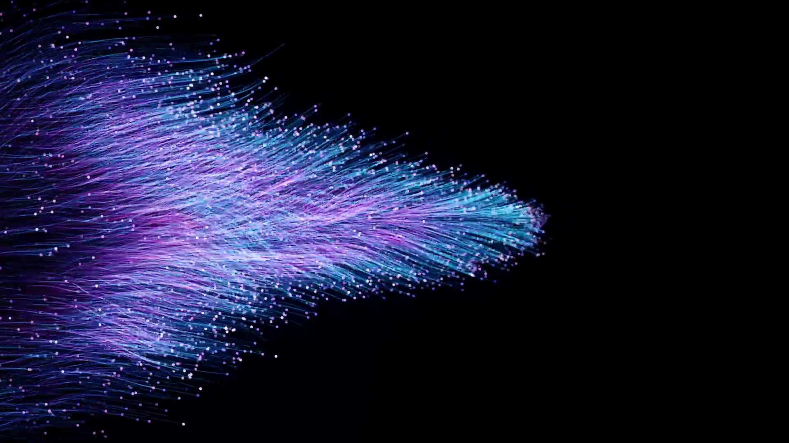

# 画像差し替え source

画像は `assets/images/` に下記ファイル名で配置してください。
このドキュメント内の画像リンクも同じ配置先を参照しています。

注意: 拡張子はコード上 `.jpg` に固定しています。PNGやWebPを使う場合は、JPGとして書き出すか、コード側のファイル名も変更してください。

## 必須画像

| No. | 用途 | 配置ファイル名 | 推奨比率 | 使用箇所 |
|---:|---|---|---|---|
| 01 | トップ メインヒーロー 静止画 | [`assets/images/liveons-hero-main.jpg`](../assets/images/liveons-hero-main.jpg) | 横長 16:9 以上 | `index.html` トップヒーロー 静止画表示時 |
| 02 | インフルエンス事業 | [`assets/images/liveons-service-influence.jpg`](../assets/images/liveons-service-influence.jpg) | 4:3 | トップ事業カード / 事業内容ページ |
| 03 | プロモーション支援事業 | [`assets/images/liveons-service-promotion.jpg`](../assets/images/liveons-service-promotion.jpg) | 4:3 | トップ事業カード / 事業内容ページ |
| 04 | システム開発事業 | [`assets/images/liveons-service-system.jpg`](../assets/images/liveons-service-system.jpg) | 4:3 | トップ事業カード / 事業内容ページ |
| 05 | 代表ポートレート | [`assets/images/liveons-representative-portrait.jpg`](../assets/images/liveons-representative-portrait.jpg) | 縦長 4:5 | トップ代表メッセージ / 代表メッセージページ |
| 06 | トップヒーロー 動画ポスター | [`assets/images/liveons-hero-poster.jpg`](../assets/images/liveons-hero-poster.jpg) | 横長 16:9 | 動画読み込み前 / 省データ環境用 |

## プレビューリンク

画像を配置すると、下のプレビューにも表示されます。

### 01 トップ メインヒーロー

### 02 インフルエンス事業

### 03 プロモーション支援事業

### 04 システム開発事業

### 05 代表ポートレート

### 06 トップヒーロー 動画ポスター

